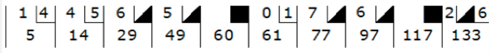

# Pre-admisión: Programación Orientada a Objetos

El propósito de este ejercicio es conocer tus habilidades de programación, puedes utilizar el lenguaje que prefieras. Tu solución deberá mostrar el uso de los principios de la programación orientada a objetos. Es decir, deberá estar organizado en clases con métodos y atributos.

No vamos a evaluar que tan experto eres, lo que buscamos es comprobar que tienes las bases necesarias para poder aprovechar al máximo nuestro programa.

## Requerimientos funcionales
 

- The game consists of 10 frames as shown above. In each frame the player has two opportunities to knock down 10 pins. The score for the frame is the total number of pins knocked down, plus bonuses for strikes and spares.
- A spare is when the player knocks down all 10 pins in two tries. The bonus for that frame is the number of pins knocked down by the next roll. So in frame 3 above, the score is 10 (the total number knocked down) plus a bonus of 5 (the number of pins knocked down on the next roll.)
- A strike is when the player knocks down all 10 pins on his first try. The bonus for that frame is the value of the next two balls rolled.
- In the tenth frame a player who rolls a spare or strike is allowed to roll the extra balls to complete the frame. However no more than three balls can be rolled in tenth frame.

## Requerimientos no-funcionales
- Ejecución
  - [ ] Puede ejecutarse desde la linea de comandos y mostrar la salida en consola 
- Código fuente
  - [ ] Orientado a Objetos 
  
## Tecnologías
- Lenguaje de programación de elección libre
- Línea de comando

## Entregable
- [ ] Código fuente en Github
  - La solución debe cumplir con los requerimientos funcionales y no funcionales

## Evaluación / Revisión
- [ ] Cumplimiento de los requerimientos funcionales
- [ ] Cumplimiento de los requerimientos no funcionales 
- [ ] Orientación a objetos

## Tiempo
- 7 días para resolver el ejercicio

## Preguntas Frecuentes

### ¿Cómo deben ingresarse los datos al juego?
Pede ser de manera manual o automática (números aleatorios,o capturados de manera individual desde el teclado, por ejemplo), es como tu decidas.

### ¿Debe tener una interfáz gráfica GUI?
No, no es necesario que el programa tenga GUI puede ser un programa de consola.
